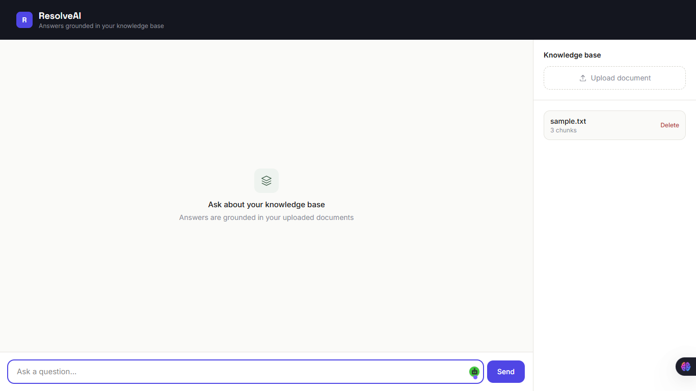
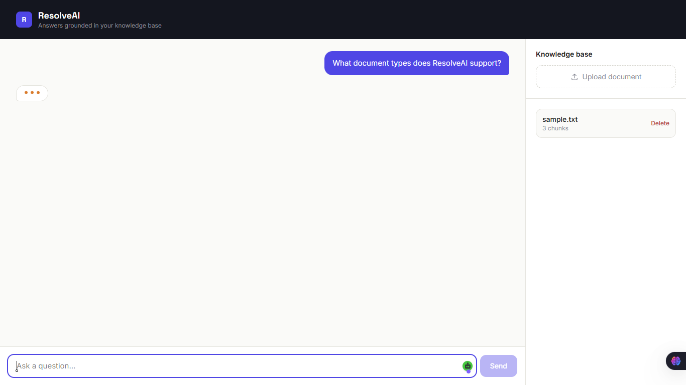
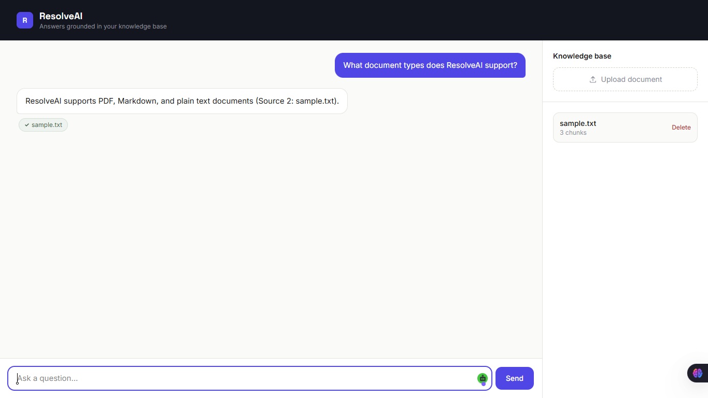
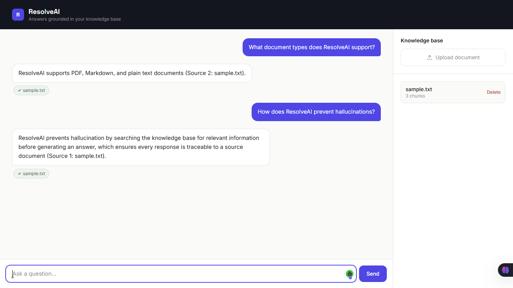

# ResolveAI

> AI-powered customer support assistant using Retrieval-Augmented Generation (RAG).

## The problem

Customer support teams answer the same questions repeatedly, and generic
LLM chatbots hallucinate answers not grounded in a company's actual
documentation. ResolveAI solves both: it retrieves relevant knowledge
base content before generating an answer, and cites its sources.

## How it works

1. Documents (PDF, Markdown, TXT) are chunked and embedded using
   BAAI/bge-small-en-v1.5.
2. Chunks are stored in ChromaDB as vectors.
3. A user question is embedded and matched against stored chunks via
   cosine similarity.
4. The top-k matching chunks are passed to an LLM (Gemini) as context.
5. The model answers using only that context, and cites its sources.
   If the knowledge base has no relevant information, it says so
   instead of guessing.

## Screenshots

## Architecture

Frontend (React) → FastAPI → Retrieval (ChromaDB) → LLM (Gemini) → Answer + citations

## Tech stack

- **Backend:** Python 3.12, FastAPI
- **Embeddings:** BAAI/bge-small-en-v1.5 (sentence-transformers)
- **Vector store:** ChromaDB
- **LLM:** Gemini API (pluggable — see `app/rag/llm/`)
- **Frontend:** React, Vite, Tailwind CSS v4
- **Database:** SQLite
- **Deployment:** Docker, Docker Compose

## Running locally

\`\`\`bash
git clone https://github.com/pulindu117/resolve-ai.git
cd resolve-ai
cp backend/.env.example backend/.env
# add your GEMINI_API_KEY to backend/.env
docker-compose up --build
\`\`\`

Frontend: http://localhost:5173
API docs: http://localhost:8000/docs

## Running tests

\`\`\`bash
cd backend
pytest tests/ -v
\`\`\`

## Design decisions

- **No LangChain.** Built the RAG pipeline from scratch to understand
  chunking, retrieval, and prompt construction at a mechanical level
  rather than through framework abstractions.
- **Pluggable LLM provider.** The generation module is isolated so
  switching providers (Claude, Gemini, others) requires changing one
  file, not the pipeline.
- **Character-based chunking with overlap.** Chosen for simplicity and
  interpretability; a natural next step would be semantic or
  sentence-aware chunking.

## Known limitations

- Retrieval can favor lexical overlap (e.g. matching a proper noun in
  the query) over deeper semantic relevance — a reranking step would
  address this.
- No conversation memory yet — each question is answered independently.
- No authentication on upload/delete endpoints.

## Roadmap

- [x] v0.1 — Project scaffold
- [x] v0.2 — Document ingestion pipeline
- [x] v0.3 — Embeddings and vector storage
- [x] v0.4 — Retrieval engine
- [x] v0.5 — Generation with Gemini
- [x] v0.6 — REST API
- [x] v0.7 — React frontend
- [x] v1.0 — Docker, tests, documentation